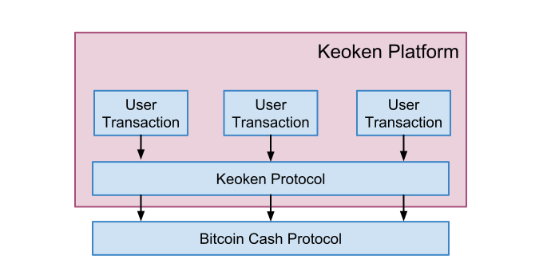
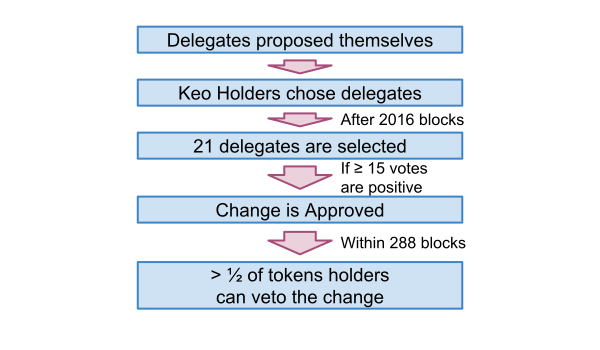
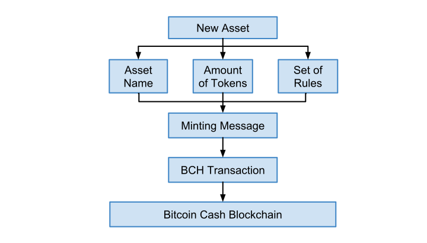

# Keoken

*An open protocol for extending blockchain functionality*

*Juan Garavaglia, Fernando Pelliccioni, Mario Dal Lago, Ramiro Carlucho, Dario Ramos, Guillermo Paoletti, Gerardo Arceri, Renzo Barrionuevo, Mateo Friedman & Mariano Orsili.*

**_Bitprim Project Inc._**

dev@bitprim.org

## Introduction

Since the creation of Bitcoin, defined by the Satoshi Nakamoto White Paper, a vibrant ecosystem has been created. The vision of P2P Electronic Cash expanded the horizons on how we can transact among parties. Today, we have a well proven technology and a solid operational platform where trustless transfers of value are recorded with optimal levels of decentralization and immutability.

Cryptocurrencies are created to facilitate commerce, parties can trade without a centralized entity controlling the medium of exchange for the transactions. 

Facilitating commerce has a direct impact on wealth creation, therefore improving commerce benefits in economic development.

*Keoken* is a decentralized commerce development platform on top of the cryptocurrency layer. Its main mission is to help decentralizing trade.

Currency is necessary for trade, without it, transactions are more complex and inefficient, but commerce requires several different types of transactions than just moving value between two parties. This second layer protocol enables a massive use of cryptocurrencies providing the required transaction formats used in commerce.

Real world transactions have several basic commonly used transaction types, like cash, credit/debit cards, bank transfer, letter of credit, bank checks, futures and others. There is also a wide range of commonly used transactions that do not have a monetary nature like securities, titles of ownership and others. While the Bitcoin platform has a well proven system to transact in a native coin, it lacks (or it is too complex to execute) more sophisticated types of transactions or the use of any other assets but its native token. Bitcoin ensures transactions to be non-reversible, trustless and with a good level of censorship resistance, while in commerce, it is sometimes desirable to relax one or more of those features in favor of convenience, therefore increasing usability and adoption.

Parties involved in a commercial transaction have to be free to determine the level of trust or reversibility they feel comfortably accepting at the time of executing said transaction. Freedom to define the rules for using their transactions is one of the pillars of the *Keoken* protocol.

The only few transactions that do not fit into this default transaction types are the ones that use customized contracts to define the specific rules of the transaction. Contracts are desirable only when regular transaction types do not fit into the nature of the agreement. Since contracts are more complex, they are therefore more expensive to create and interpret. In the worst case, the intrinsic complexity of contracts may create an unexpected outcome or even be maliciously abused, where the contract itself unintentionally (or not) opens a surface of attack. While Smart Contracts are nice to have, it is more effective to both have a large set of pre-defined transactions to tackle the most common types of exchanges between parties and to restrict Smart Contracts to avoid defining what already exists and prevent abusive use.

We have today the Bitcoin Cash platform that has a good balance between security, provided by a solid PoW level, and an on-chain capacity to build on top of it. These are the reasons why we consider that Bitcoin Cash has the best balance to start building a Layer 2 solution on top of it.

## Description

*Keoken* is a second layer solution that brings a digital asset accounting and a secure smart contracts platform, Focused on real world use cases, approaching them in an efficient and simple way, it intends to cover most of the situations that involve value transfers between parties and businesses, as well as the rules required to run most common activities.

*Keoken* fills the gap between reliable cryptocurrencies protocols and less reliable smart contracts platforms based on Turing complete programming languages.

It prioritizes solutions that integrate existing, proven, technologies in a smart way, avoiding the pitfalls of promising what it cannot deliver or defining goals with unclear execution plan or outcomes.

The platform includes a native token *Keo*, a simple governance model and a sustainable development funding model.

It is designed to adapt to changing market conditions, including rules and processes to change any aspect of the Keoken ecosystem. We promote and encourage parties to freely define their own exchange rules.

Resources are always limited. Computing, storage and bandwidth have a cost. In order to succeed, Keoken has a realistic approach to the resources utilization, since when we apply some cost restrictions to some transactions or assets we limit the abusive use of the network. A smart allocation of resources will create the cheapest platform to use, being this the result of a competitive and realistic  approach using dynamic rules to foster the use of the platform. Sometimes unlimited and free are the most expensive options.

Keoken has an account based approach where we store states in order to have  multi-asset simplified transaction capabilities.

This project has been influenced by several pre existent projects like BitcoinCash, Omni/Mastercoin, RSK/Ethereum, Decred, Dash, CounterParty, EOS and others, but it is built from scratch leveraging [Bitprim-Node](https://github.com/bitprim/bitprim) advanced features. Other teams are encouraged to build their own implementations of the protocol and we will actively cooperate with them in the process. Today, we have a better understanding of the ecosystem’s potential than the one we had when older projects were launched and we consider that in order to scale, it is necessary to maintain the functionalities that were proposed, but with a completely new code, developed entirely from the base.

## Terminology

* [*Keoken Protocol.* Protocol defined by Spec.](keoken-technical-specification.md)

* *Keoken Platform.* Open Source Protocol reference implementation, operational infrastructure and additional services. 

* *Keo.* Native token for Keoken platform fees and for governance purposes.

* *Transaction Formats (TF).* Pre-defined transactions models.

## Basic concepts

A Second layer protocol should address issues known by several blockchain platforms, namely:

* Scalability.

* Cost of Transaction.

* Speed of Confirmation.

* Governance.

* Upgrades.

* Intentional and unexpected fork handling.

* Letting issuers address regulatory requirements.

Keoken has the following basic characteristics:

* Keoken (*Keoken protocol*) is a protocol to exchange digital assets in a new smart layer on top of existent blockchains. Its main mission is to allow more advanced transaction types and use cases.

* It is an open-source platform (*Keoken platform*) where users can create and transfer assets and also build more sophisticated distributed applications.

* It Includes a native token (*Keo*) which is used to manage the protocol’s governance, payment fees associated with the transactions in the platform and lastly to fund the development of the platform.

* The protocol is based in Transaction Formats (*TF*) and codable business rules (*Smart Contracts*). Transaction Formats will cover the most common types of transactions being used in the real world and, in the future, we expect to see an increased number of them. Once the Transaction Formats are mature enough and we have covered most of the possible use cases, we will focus on adding a more flexible way to code custom made business rules.

* The evolution of the smart contracts scripting/programing language will be based on real use cases. We pick one specific user need and we develop the primitive commands required to build that user case and so on.

* Keoken platform does not require all the transactions to be stored on-chain, some type of transactions can be merged into a single transaction to reflect the latest state. One of the goals is to provide the platform to avoid storing transactions that will not be relevant in the future forever on-chain. 

## Protocol development vision

There is an emerging ecosystem of peer-to-peer platforms to achieve decentralized computing, having each project its own scope and mission. Keoken protocol has an incremental development approach with focus on real world use cases, creating solutions for existing problems and achieving that goal with technologies that work. It will therefore create an ecosystem with organic growth and constant evolution. It is Keoken’s vision that a clear definition of both achievable goals and how they will be achieved is the preferred way to move forward with the platform development, avoiding too ambitious goals with unclear definitions or where the tools to achieve them do not exist.

## Protocol governance

Evolution is an important part of any decentralized protocol and has to be an integral part of it. Decentralized protocols are in their early stages. Therefore, they need the capacity to evolve, improve and change. In this new ecosystem the capacity to adapt to a new reality is a key feature to be successful. The governance model itself has to be able to change over time. An efficient way to consider protocol changes is necessary at early stages where decisions have to be made based on the results of the initial steps, learning from the experience and adapting to changing circumstances is a key enabler for a healthy and brilliant ecosystem.

Keoken native token (Keo) holders vote what features will be included in the protocol, meaning there is a simple, transparent and fast process to define protocol evolution. The governance procedure does not allow to make changes in specific transactions or balances. Only private key holders have control over their own funds, whereas Keo holders have voting rights over protocol changes.

This model of governance can be changed at any time by a majority of votes. An amount greater than ⅔ of the votes will be mandatory for it to happen.

For governance purposes, Keo holders willing to participate in the decision making process have to choose a delegate from a list of users that had expressed intention to be delegates. A number of 21 delegates will be chosen within the next two weeks (2016 Blocks). Only delegates are authorized to vote and a minimum of 15 votes are required to approve a change. There is a two-day (288 blocks) veto period following any change approval. If said change is voted against by more than a half of token holders, the approved change shall be vetoed.

We understand this may not be a perfect governance model, yet we believe that the lack of a simple and transparent way of governance is the most opaque governance model, where it is not clear how decisions should be made and it is not clear why some decisions were taken, leading to protocol development stagnation and/or the taking of risky decisions. We expect Keoken’s governance model to organically improve and adapt itself to the Keoken Platform needs.

Bitcoin Cash does not have a built-in governance mechanism and protocol upgrades require hard forks. As a second layer protocol, a fork in the underlining blockchain requires Keoken to use the voting mechanism to determine what blockchain protocol version is valid for the platform. This is necessary to avoid same assets to be valid in two different blockchains and losing storage integrity 

The voting process may change the rules defined in this document, but cannot interfere in the rules of each asset defined in the platform.

Regarding voting rules, first, any Keo holder pushing an agenda for voting has to include the voting proposal fee and a URL to the agenda proposal. Second, Keo holders register to vote. Third, delegates vote during 24 hours. Finally, there is a voting veto period of 48 hours upon voting.

## Assets independence

In the Keoken platform any user is free to create any asset and define their particular rules. The platform does not intervene in any part of the process and there are no protocol features to forbid or censor any type of assets, which means that the issuer may include rules to revert transactions for any reason like account hacking, loss of keys or whatever rules they consider convenient for which the owners of those assets had agreed upon. The Keoken protocol does not have the power to intervene in those "business rules" based on the premise that agreements between private parties are laws in that relationship.

## Platform and protocol development costs

Concepts such as governance and clear and transparent funding for development are integral parts from which the protocol design is based on. As it had been said before, decentralized computing is a new ecosystem. If the funding source for development is not clearly defined, it is not possible to guarantee that the development of the protocol will be aligned with the interests of the users of the platform. Again, even if it is not perfect, it is better to have a clear definition than the lack of it. 

Some or all transactions (like creating a new asset) will incur in a fee. Collected fees go to a special address where nobody can spend them. From time to time, using the governance voting process may help deciding what to do with those Keo tokens in the "Fees" special account. It may be decided to either destroy those tokens, distribute them proportionally to Keo holders, fund the platform requirements (development and others) or any combination of those options or something completely different.

## Fees

In the real world, when transactions are B2C (business-to-consumer) or E-Commerce, the seller usually pays the fees, but in B2B (business-to-business), the buyer usually pays for them. Keoken allows an analogous structure.

An assets creator defines which party is responsible for paying the fees. It is also possible for the asset creator to sponsor the fees of the asset.

Fees structure can be changed by the governance model and it is expected to be changed from time to time.

Assets are eternal, but have a registration fee and a renewal fee. Since resources are never unlimited, fees discourage the existence of assets with no real use. Each asset type has different fees, in some cases for example, land property registry may not have a renewal fee, but has a higher transaction fee.

For reference, simple transactions should cost about US$ 0.01 and new asset creation/renewal should cost around US$ 1,000. Additionally, submitting a change for voting has a cost also.

## Features

### Most common use cases

* *Native Token (KEO).*

* *Token issuing.*

* *Units issuing.*

* *Fund Raising.*

* *Stablecoins.*

* *Trusts.*

* *Securities.*

* *Futures.*

* *Decentralized Exchange.*

* *Digital collectibles.*

* *Verification.*

* *Auction.*

* *Reserved Funds.*

### Most common transaction types

* *Asset Creation.*

* *Send Tokens/Units.*

* *Voting proposal.*

* *Reversible Send:* A transaction that can be reversible within a determined period of time.

* *Compromised Key Message:* Informs the platform that one wallet has been compromised.

* *Vault:* Each account has a vault where assets may have some restrictions to be spent.

* *Transaction throttling limit:* It limits the maximum volume and frequency authorized to account owners.

* *Endorsable Transactions*.

* *Send to everyone:* Can also be used to send a message to every token holder of a given asset.

* *Data storage/send.*

### Keoken service providers 

Some of the following services are internal while others are accessible via APIs and may require a fee.

* *Native Keoken voting engine.*

* *Wallet Name System:* For registering easy to remember names as a proxy of wallet addresses.

* *Asset Name System "Anti-Counterfeit".*

* *Reputation Provider:*

    * Reputation provider will track record transactions involved in an account and feedback provided of the other accounts involved in those transactions.

    * "Known By" may provide other accounts that know this account holder. This may be used for asset recovery or other purposes.

* *KYC/AML providers.*

* *Save in Blockchain by proxy:* Users trading a token can complete a transaction in their own token and hire a third party to store that transaction in the blockchain with fees in BCH (or mainnet currency).

* *Data Feed Providers:* They store data feeds in the blockchain, for example USD/RMB exchange rates. They also define a fee to use that data feed. Any transaction invoking that data feed has to pay the fee determined by the creator.

* *Transaction Guarantor:* In case a seller without negligent behavior does not receive the payment from the payee, the guarantor honors that payment. Guarantor responsibilities ends when the seller settles the transaction.

* *Pending Confirmation:* Confirmation pending transactions are stored to determine the available balance to transact.

* *Corvina Storage:* Stores a complete log of all transactions with regular hash commitments to the blockchain to provide a fast bootstrapping of new nodes or light wallets.

* *Escrow.*

* *Mediation/Resolution.*

* *Storage Provider.*

## Emergency transactions

### Emergency transactions are only allowed to delegates.

* *Forks handling.*

* *Upgrades.*

* *Emergency Pause/Restart Platform.*

* *Emergency Pause the trading of one asset.*

## Conclusion

Keoken has been designed having efficiency in mind, using well known technologies by a solid team. It provides the necessary rails for commerce over a decentralized blockchain ecosystem.

Due to its simple design it can be easily implemented over the Bitcoin Cash protocol and other blockchains.

Most blockchain scaling solutions tend to be restrictive or too complex to use in the majority of cases. Instead, Keoken give asset creator the power to define its own rules. On top of that Keoken holders can control the future of the protocol by participating in its multi-layer dynamic governance system.

## About Bitprim

Since 2014, our multidisciplinary team has been creating tools that help and attract developers to boost a massive adoption of cryptocurrencies. Bitprim's main pillars are transparency, professionalism, customer service and collaboration with other teams. Keoken is an open protocol with a performance reference implementation built from scratch leveraging [Bitprim-Node](https://github.com/bitprim/bitprim) advanced features. Bitprim headquarters are based in Argentina.

